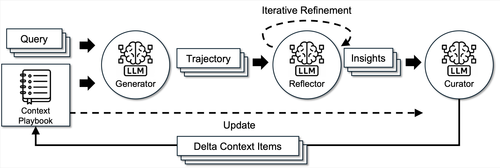

# Agentic Context Engineering: Evolving Contexts for Self-Improving Language Models

<div align="left">

<p align="left" style="display:flex; gap:18px;">
  <a href="https://arxiv.org/abs/2510.04618" target="_blank" style="margin-right:0;">
    
  </a>
  <a href="https://join.slack.com/t/ace-agent/shared_invite/zt-3np7gusuf-DCUJaBshNjuAz5ECDx702w" target="_blank" style="margin-right:0;">
    
  </a>
  <a href="https://discord.gg/NW2W4xYt" target="_blank" style="margin-right:0;">
    
  </a>
  <a href="https://deepwiki.com/ace-agent/ace" target="_blank" style="margin-right:0;">
    
  </a>
  <a href="https://forms.gle/ZNJpqVBRa8QoPjzM7" target="_blank" style="margin-right:0;">
    
  </a>
</p>




</div>

---

## 🎯 Overview

ACE (Agentic Context Engineering) is a framework that enables large language models to self-improve by treating contexts as evolving playbooks that accumulate, refine, and organize strategies through a modular process of generation, reflection, and curation. Unlike traditional approaches that suffer from **brevity bias** and **context collapse**, ACE introduces structured, incremental updates guided by a grow-and-refine principle, preserving detailed, domain-specific knowledge while remaining comprehensive and scalable throughout adaptation.

## Latest News
- **2025 Nov**: ACE [Paper](https://arxiv.org/abs/2510.04618) and Repo says "Hello World"!

### Key Features

- 🔄 **Three-Role Agentic Architecture**: Generator, Reflector, and Curator work together to continuously improve contexts
- 📈 **Incremental Delta Updates**: Localized edits that preserve prior knowledge while accumulating new insights
- 🎓 **Self-Supervised Learning**: Adapts effectively without labeled supervision by leveraging natural execution feedback
- 🚀 **High Efficiency**: 86.9% lower adaptation latency on average compared to existing adaptive methods
- 💰 **Cost Effective**: Significantly fewer rollouts and lower dollar costs while achieving higher accuracy

### Tutorials
- 📚 **Adding Dataset for Evaluation** [Link](tutorials/ExtendingDatasets.md)
- ✨ **Extending ACE for Tool Calling** (Coming Soon) 

### 📊 Performance

ACE consistently outperforms strong baselines, achieving average gains of **+10.6%** on agent tasks and **+8.6%** on domain-specific benchmarks, across both offline and online adaptation settings.

#### Benchmarks

| Task Category | Dataset | Improvement | Details |
|---------------|---------|-------------|---------|
| **Agent Tasks** | AppWorld | +10.6% | Matches top-ranked production-level agent (GPT-4.1) on average and surpasses it on harder test-challenge split, using smaller open-source model |
| **Finance** | FiNER + XBRL Formula | +8.6% | Domain-specific reasoning with structured information extraction |

#### Efficiency Improvements

- **Offline (AppWorld)**: -82.3% latency and -75.1% rollouts vs GEPA
- **Online (FiNER)**: -91.5% latency and -83.6% token cost vs Dynamic Cheatsheet


#### How It Works

1. **Generator** produces reasoning trajectories for new queries, surfacing both effective strategies and recurring pitfalls
2. **Reflector** separates evaluation and insight extraction from curation, improving context quality
3. **Curator** converts lessons into structured delta updates with helpful/harmful counters, using deterministic merging with de-duplication and pruning

This design prevents the **context collapse** problem where iterative rewriting erodes details over time.

## 🚀 Quick Start

### Installation

```bash
# Clone the repository
git clone https://github.com/ace-agent/ace.git

# Install dependencies
pip install -r requirements.txt

# Set up API keys
cp .env.example .env
# Edit .env with your API keys
```

### Basic Usage

```python
from ace import ACE
from utils import initialize_clients

# Initialize API clients
api_provider = "sambanova" # or "together", "openai"

# Initialize ACE system
ace_system = ACE(
    api_provider=api_provider,
    generator_model="DeepSeek-V3.1",
    reflector_model="DeepSeek-V3.1",
    curator_model="DeepSeek-V3.1",
    max_tokens=4096
)

# Prepare configuration
config = {
    'num_epochs': 1,
    'max_num_rounds': 3,
    'curator_frequency': 1,
    'eval_steps': 100,
    'online_eval_frequency': 15,
    'save_steps': 50,
    'playbook_token_budget': 80000,
    'task_name': 'your_task',
    'json_mode': False,
    'no_ground_truth': False,
    'save_dir': './results',
    'test_workers': 20,
    'use_bulletpoint_analyzer': false,
    'api_provider': api_provider

}

# Offline adaptation
results = ace_system.run(
    mode='offline',
    train_samples=train_data,
    val_samples=val_data,
    test_samples=test_data,  # Optional
    data_processor=processor,
    config=config
)

# Online adaptation
results = ace_system.run(
    mode='online',
    test_samples=test_data,
    data_processor=processor,
    config=config
)

# Evaluation only
results = ace_system.run(
    mode='eval_only',
    test_samples=test_data,
    data_processor=processor,
    config=config
)
```

## 💼 Finance Domain Example

### Training Script Usage

The `finance/run.py` script provides a unified interface for training and evaluation on financial analysis tasks.

```bash
# Offline training (with automatic initial and final testing)
python -m eval.finance.run \
    --task_name finer \
    --mode offline \
    --save_path results

# Online training and testing
python -m eval.finance.run \
    --task_name finer \
    --mode online \
    --save_path results

# Run evaluation on the test split only. Provide a pre-trained playbook or leave initial_playbook_path empty to evaluate an uninitialized playbook.
python -m eval.finance.run \
    --task_name finer \
    --mode eval_only \
    --initial_playbook_path results/ace_run_TIMESTAMP_finer_offline/best_playbook.txt \
    --save_path test_results

# Training with custom configuration
python -m eval.finance.run \
    --task_name finer \
    --mode offline \
    --save_path results \
    --num_epochs 3 \
    --eval_steps 100 \
    --max_tokens 4096
```

#### Available Arguments
<details>
<summary>Click here to see available arguments</summary>

| Argument | Description | Default |
|----------|-------------|---------|
| `--task_name` | Task to train on (e.g., `finer`, `formula`) | Required |
| `--save_path` | Directory to save results | Required |
| `--initial_playbook_path` | Path to initial playbook | Optional |
| `--mode` | Run mode: 'offline' for offline training with validation, 'online' for online training and testing on test split, 'eval_only' for evaluation only | `offline` |
| `--api_provider` | API provider for LLM calls. Choose from ['sambanova', 'together', 'openai'] | `sambanova` |
| `--num_epochs` | Number of training epochs | 1 |
| `--max_num_rounds` | Max reflection rounds for incorrect answers | 3 |
| `--curator_frequency` | Run curator every N steps | 1 |
| `--eval_steps` | Evaluate every N steps | 100 |
| `--online_eval_frequency` | Update playbook every N samples for evaluation in online mode | 15 |
| `--save_steps` | Save intermediate playbooks every N steps | 50 |
| `--max_tokens` | Maximum tokens for LLM responses | 4096 |
| `--playbook_token_budget` | Total token budget for playbook | 80000 |
| `--test_workers` | Number of parallel workers for testing | 20 |
| `--generator_model` | Model for generator | `DeepSeek-V3.1` |
| `--reflector_model` | Model for reflector | `DeepSeek-V3.1` |
| `--curator_model` | Model for curator | `DeepSeek-V3.1` |
| `--json_mode` | Enable JSON mode for structured output | False |
| `--no_ground_truth` | Don't use ground truth in reflection | False |
| `--use_bulletpoint_analyzer` | Enable bulletpoint analyzer for playbook deduplication and merging | False |
| `--bulletpoint_analyzer_threshold` | Similarity threshold for bulletpoint analyzer (0-1) | 0.9 |

</details>

## 📈 Results and Outputs

Using offline training as an example, after training, ACE generates:

```
results/
└── ace_run_TIMESTAMP_finer_offline/
    ├── run_config.json                # Training configuration
    ├── final_results.json             # Consolidated results from all stages
    ├── initial_test_results.json      # Initial test results with empty playbook (baseline)
    ├── final_test_results.json        # Final test results with best playbook
    ├── train_results.json             # Training results
    ├── val_results.json               # Validation results and error logs
    ├── pre_train_post_train_results.json     # Detailed pre-train and post-train generator output for each training sample
    ├── final_playbook.txt             # Final evolved context
    ├── best_playbook.txt              # Best performing context (only for offline training)
    ├── bullet_usage_log.jsonl         # Bullet usage tracking
    ├── curator_operations_diff.jsonl  # Curator operation tracking
    ├── detailed_llm_logs/             # Detailed LLM call logs
    └── intermediate_playbooks/        # Intermediate playbooks 
```

### Understanding Playbook Format

The evolved context (playbook) follows this structure:

```
## STRATEGIES & INSIGHTS
[str-00001] helpful=5 harmful=0 :: Always verify data types before processing
[str-00002] helpful=3 harmful=1 :: Consider edge cases in financial data

## FORMULAS & CALCULATIONS
[cal-00003] helpful=8 harmful=0 :: NPV = Σ(Cash Flow / (1+r)^t)

## COMMON MISTAKES TO AVOID
[mis-00004] helpful=6 harmful=0 :: Don't forget timezone conversions
```

Each bullet has:
- **ID**: `[section_slug-00000]` for tracking
- **Counts**: `helpful=X harmful=Y` updated by Reflector
- **Content**: `:: actual advice or strategy`

<!-- ## 🎓 Key Innovations

### 1. Incremental Delta Updates

Instead of rewriting full prompts, ACE performs delta updates—localized edits that accumulate new insights while preserving prior knowledge.

### 2. Grow-and-Refine Mechanism

A mechanism that balances steady context expansion with redundancy management by merging or pruning context items based on semantic similarity.

### 3. Dedicated Reflector

A specialized Reflector that separates evaluation and insight extraction from curation, improving context quality and downstream performance. -->

### 📬 Supported Tasks
#### Agent Tasks
- **AppWorld**: Simulated digital environment with app interactions
#### Domain-Specific Tasks
- **FiNER**: Financial information extraction
- **XBRL Formula**: Structured financial data processing

## 🛠️ Extending ACE

ACE is designed to be easily extended to new tasks and domains. To add your own task:

1. **Prepare your data**: Create JSONL files with train/val/test splits
2. **Implement DataProcessor**: Only 3 methods needed - `process_task_data()`, `answer_is_correct()`, `evaluate_accuracy()`
3. **Create training script**: Initialize ACE and run training using the `run()` method
4. **Customize prompts** (optional): Adapt prompts to your domain

The evaluation orchestration (parallel test execution, result aggregation) is handled by reusable utilities in `utils.py`, so you only need to focus on task-specific logic.

### Quick Example

```python
class DataProcessor:
    def process_task_data(self, raw_data):
        # Convert your data format to standardized format
        return [{"context": ..., "question": ..., "target": ..., "others": {...}}]
    
    def answer_is_correct(self, predicted, ground_truth):
        # Your comparison logic
        return predicted.strip() == ground_truth.strip()
    
    def evaluate_accuracy(self, predictions, ground_truths):
        # Calculate accuracy
        return sum(self.answer_is_correct(p, g) for p, g in zip(predictions, ground_truths)) / len(predictions)
```
📖 **[Read the full extension guide →](EXTENDING_ACE.md)**


## 🤝 Contributing
We welcome contributions! Please follow these steps:
1. Fork the repository
2. Create a feature branch (`git checkout -b feature/amazing-feature`)
3. Commit your changes (`git commit -m 'Add amazing feature'`)
4. Push to the branch (`git push origin feature/amazing-feature`)
5. Open a Pull Request


## 📚 Additional Resources
- **Blog Posts**: 
  - [Medium: Agentic Context Engineering](https://medium.com/@bingqian/agentic-context-engineering-teaching-language-models-to-learn-from-experience-706c31a872ca)
  - [MarkTechPost Coverage](https://www.marktechpost.com/2025/10/10/agentic-context-engineering-ace-self-improving-llms-via-evolving-contexts-not-fine-tuning/)
  - [InfoQ Article](https://www.infoq.com/news/2025/10/agentic-context-eng/)

### 🙏 Acknowledgments
This work builds upon insights from Dynamic Cheatsheet and incorporates ideas from the broader LLM agent and context optimization research community.

### 📧 Contact
For questions and feedback:
- **Paper Authors**: See [arXiv paper](https://arxiv.org/abs/2510.04618) for author contact information
- **Issues**: Please open an issue on GitHub
- **Discussions**: Join the [GitHub Discussions](../../discussions)

---


## 📝 Citation

If you use ACE in your research, please cite our paper:

```bibtex
@misc{zhang2025agenticcontextengineeringevolving,
      title={Agentic Context Engineering: Evolving Contexts for Self-Improving Language Models}, 
      author={Qizheng Zhang and Changran Hu and Shubhangi Upasani and Boyuan Ma and Fenglu Hong and Vamsidhar Kamanuru and Jay Rainton and Chen Wu and Mengmeng Ji and Hanchen Li and Urmish Thakker and James Zou and Kunle Olukotun},
      year={2025},
      eprint={2510.04618},
      archivePrefix={arXiv},
      primaryClass={cs.LG},
      url={https://arxiv.org/abs/2510.04618}, 
}
```

<div align="center">

**⭐ Star us on GitHub if ACE helps your research!**

Made with ❤️ by the ACE team

</div>