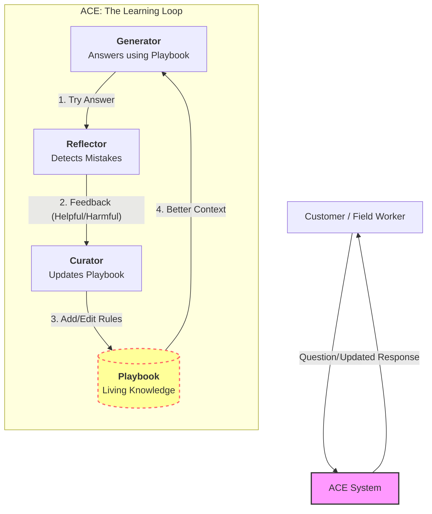

# ACE 시스템 최종 검토 의견서 (Final Review & Opinion)
**작성일**: 2026-02-04
**수신**: Project Stakeholders

## 1. 종합 의견 (Executive Summary)

**"ACE는 초기 학습 비용(Initial Cost)은 발생하지만, 유지보수 비용(Maintenance Cost)을 획기적으로 낮추는 '자율 진화형' 솔루션입니다."**

1, 2차 평가를 통해 ACE 시스템은 **"스스로 규칙을 만들고(Self-Creation), 수정하며(Self-Correction), 상황을 구분하는(Case Differentiation)"** 능력을 증명했습니다. 초기에는 편향된 규칙(LOTO 과적합)을 만들기도 했지만, 경험이 쌓이면서 스스로 이를 교정하고 세분화하는 **Organic Learning(유기적 학습)** 패턴을 보였습니다.

이는 정적인 지식 베이스(Static Knowledge Base)를 매번 사람이 업데이트해야 하는 기존 RAG/SFT 시스템의 한계를 극복할 수 있는 강력한 대안입니다.

---

## 2. 평가 결과 통합 분석

| 평가 단계 | 주요 발견 | 비즈니스 의미 |
| :--- | :--- | :--- |
| **1차 평가** | **LOTO 과적합 (Naive Strategy)** | 초기에는 가장 강력한 하나의 룰에 의존합니다. (마치 신입사원처럼) |
| **2차 평가** | **규칙 분화 (Case Differentiation)** | 실패를 겪으며 "지게차엔 유도자", "화학엔 방독면" 등 상황별 룰을 스스로 생성합니다. |
| **결론** | **성장통 (Growing Pains)** | 현재 겪고 있는 규칙 충돌(Conflict)은 시스템이 정교해지는 과정의 필수적인 성장통입니다. |

---

## 3. ACE 동작 구조 (Operational Architecture)

고객에게 설명하기 위한 ACE의 핵심 루프(Loop)를 시각화했습니다.

### 핵심 메커니즘
1.  **자율 대응 (Try)**: Generator가 현재 플레이북을 보고 최선의 답변을 시도합니다.
2.  **자율 반성 (Reflect)**: 정답(Ground Truth)이나 사람의 피드백과 비교하여 "무엇이 틀렸는지" 분석합니다.
3.  **자율 수정 (Curate)**: Curator가 플레이북을 직접 수정하여, 다음번엔 같은 실수를 반복하지 않게 합니다.

---

## 4. 실제 도입 시나리오 및 제건

### ✅ 도입 추천 영역 (Good Fit)
*   **규정이 복잡하고 자주 바뀌는 분야**: 금융, 세무, 안전 규제 등.
*   **Edge Case가 많은 CS/현장 지원**: 매뉴얼에 없는 상황이 자주 발생하는 곳.
*   **데이터가 부족한 초기 서비스**: SFT(Fine-tuning)를 할 만큼 데이터가 모이지 않은 상태.

### ⚠️ 고려 사항 (Consideration)
*   **초기 학습 시간**: "신입 사원 교육" 기간(Cold Start Epoch)이 필요합니다. 도입 첫날부터 완벽하지 않습니다.
*   **전문가 개입 필요**: 초기에 엉뚱한 방향(LOTO 만능주의 등)으로 학습하지 않도록, 전문가가 플레이북을 주기적으로 리뷰(Human-in-the-loop)해주면 성능이 급격히 향상됩니다.

## 5. 최종 결론
ACE는 단순한 "검색기(Search Engine)"가 아니라, **"함께 일하며 성장하는 동료(Junior Partner)"**입니다.
고객에게 전달할 핵심 가치는 **"Rule을 사람이 일일이 코딩하지 않아도, 시스템이 알아서 노하우를 쌓아준다"**는 점입니다.

이 프로토타입 평가는 ACE가 그 가능성을 충분히 가지고 있음을 실증했습니다.
